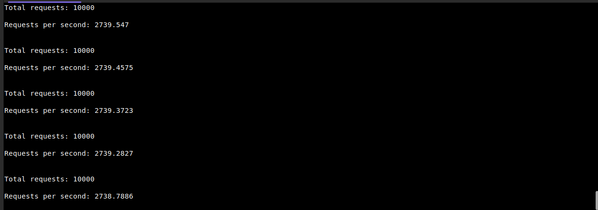

# rpc-ddos
 Script to send massive request to a rpc

## How to run bot
### With executable
```
$ cd ./executable
$ ./rpc-ddos 
```

### With cargo
```
$ cargo build --release
$ ./target/release/rpc-ddos
```

## Usage
After launching the program, you will be prompted to enter: 
- HTTP RPC request URL. 
- Threads number

## Example


## Contributing
Contributions are welcome! If you'd like to contribute to this project, contact me on my [twitter](https://twitter.com/0xHumban) for more information.

## License
This project is made available under the [Apache License, version 2.0](https://hbase.apache.org/license.html)